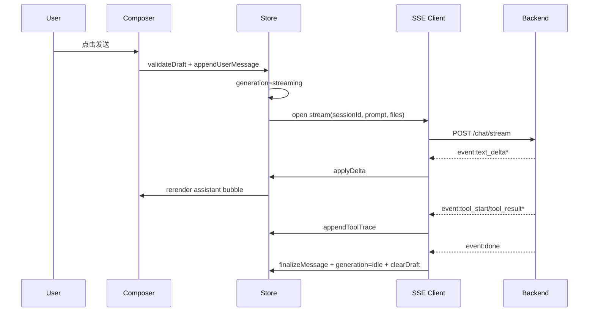
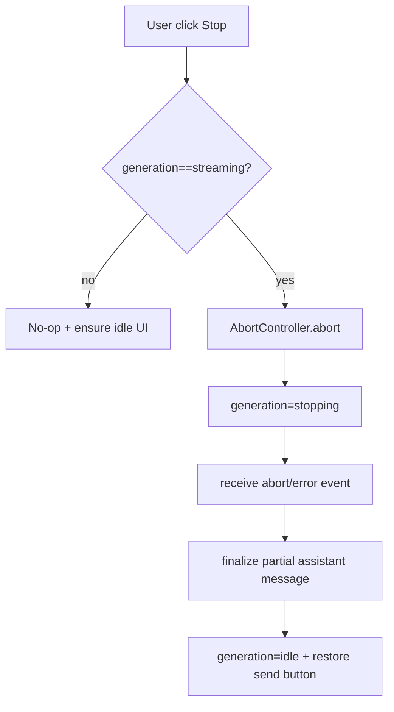

# Phase 14: Chat 前端重构总方案（对标 Copilot/ChatGPT/Claude 交互范式）

## 1. 目标 (Objective)

在保留现有业务能力（多会话、技能调用、文件上传、错题集、回收站）的前提下，将当前聊天前端从“单页脚本 + 事件散落”升级为“状态机驱动 + 统一事件协议 + 可演进模块化”的结构。

**硬约束：**
1. 保留左侧菜单中的“技能库 / 错题集”入口，不迁移为顶部菜单。
2. 对话操作遵循 Copilot 风格：消息内操作（回退/重试/复制）优先，顶部仅保留全局操作。
3. 保持流式输出体验，不退化为一次性整段渲染。

## 2. 外部对标结论 (Benchmark Findings)

### 2.1 已验证来源
- VS Code Copilot Chat 文档（会话、checkpoint、运行中消息处理）
- OpenAI ChatGPT Release Notes（Stop generating、消息内错误重试、草稿保存、移动端 composer 简化）

### 2.2 共识型交互原则（用于本项目）
1. **生成态可中断**：生成中明确可见 Stop，停止后 UI 必须立即归位。
2. **消息级操作优先**：Retry / Copy / Rollback 放在消息项内，不占据顶部全局空间。
3. **会话隔离**：每个会话独立维护“生成状态、附件草稿、回退历史”。
4. **失败可恢复**：消息失败支持就地重试，不要求用户重开会话。
5. **流式为默认路径**：SSE 事件按增量解析；失败降级路径必须可观测。

## 3. 技术栈与架构边界 (Stack & Boundaries)

- 前端：原生 HTML + Vanilla JS（不引入新框架，降低迁移风险）
- 后端：FastAPI + SSE（`/api/v1/chat/stream`）
- 存储：SQLModel（会话消息、回退归档、错题记录）

**边界原则：**
- Phase 14 不做 UI 主题重设计，不新增动画系统。
- Phase 14 不改动技能系统核心执行链，仅统一事件契约。
- 朗读/赞踩保留扩展点，不在本期实现。

## 4. 核心模块图 (Core Module Diagram)

```mermaid
flowchart LR
    UI[Chat View: index.html] --> Composer[Composer Controller]
    UI --> MessageList[Message Renderer]
    UI --> Sidebar[Session/Skill/ErrorLedger Sidebar]

    Composer --> Store[Chat Store / State Machine]
    MessageList --> Store
    Sidebar --> Store

    Store --> StreamClient[SSE Stream Client]
    StreamClient --> API[/api/v1/chat/stream]

    Store --> RollbackAPI[/api/v1/conversations/{id}/rollback]
    Store --> ArchiveAPI[/api/v1/rollback-archive]

    API --> ToolExec[Tool Executor]
    ToolExec --> ToolRegistry[Tool Registry]
    API --> DB[(ConversationMessage / RolledBackMessage)]
```

## 5. 目标目录结构 (structure.tree 概述)

```text
app/web/
  index.html
  static/
    js/
      app_bootstrap.js
      state/chat_store.js
      state/session_state.js
      stream/sse_client.js
      stream/sse_parser.js
      ui/composer_controller.js
      ui/message_renderer.js
      ui/message_actions.js
      ui/sidebar_controller.js
      services/chat_api.js
      services/rollback_api.js
      services/archive_api.js
      utils/event_bus.js
      utils/safe_json.js
```

> 说明：允许分步迁移；初期可先在 `index.html` 内通过分区函数模拟模块边界，再逐步拆分为文件。

## 6. interfaces / types（关键数据模型与函数签名）

### 6.1 前端状态模型（建议）

```ts
type GenerationStatus = 'idle' | 'streaming' | 'stopping' | 'error';

type ComposerDraft = {
  text: string;
  files: DraftFile[];
};

type DraftFile = {
  id: string;
  name: string;
  size: number;
  mime?: string;
};

type TurnMessage = {
  id: string;
  role: 'user' | 'assistant' | 'tool';
  content: string;
  toolCalls?: ToolCallRef[];
  createdAt: string;
  status?: 'ok' | 'error' | 'rolled_back';
};

type ChatSessionState = {
  sessionId: string;
  generation: GenerationStatus;
  activeMessageId?: string;
  draft: ComposerDraft;
  messages: TurnMessage[];
  rollbackCount: number;
};
```

### 6.2 SSE 事件契约（前后端统一）

```ts
type StreamEvent =
  | { type: 'text_delta'; delta: string }
  | { type: 'tool_start'; tool_name: string; call_id: string; args?: Record<string, any> }
  | { type: 'tool_result'; tool_name: string; call_id: string; ok: boolean; result?: any; error?: string }
  | { type: 'usage'; usage: Record<string, any> }
  | { type: 'done'; message_id?: string }
  | { type: 'error'; error: string; code?: string };
```

### 6.3 关键函数签名

```ts
function sendMessage(input: string, files: File[]): Promise<void>;
function stopGeneration(reason?: string): void;
function rollbackLastTurn(sessionId: string): Promise<{ rolled_back: number }>;
function retryFromMessage(messageId: string): Promise<void>;
function parseSSEChunk(chunk: string): StreamEvent[];
function resetGenerationState(sessionId: string): void;
```

## 7. logic_flow（核心业务流程）

### 7.1 发送 + 流式渲染



### 7.2 停止生成



### 7.3 回退上一轮（消息内入口）

```mermaid
flowchart TD
    A[User click Rollback in message action bar] --> B[Call DELETE /conversations/{id}/rollback]
    B --> C{rolled_back > 0 ?}
    C -- no --> D[Toast: 无可回退轮次]
    C -- yes --> E[Reload conversation from backend]
    E --> F[Refresh rollback archive panel]
    F --> G[Re-render message list by server source of truth]
```

## 8. 分阶段实施计划 (Implementation Phases)

### P0（稳定性封板，1 天）
- 固化 `send/stop/load/create` 四处统一状态归位函数。
- SSE parser 统一为 buffer 增量解析（禁止散落解析逻辑）。
- 增加最小观测日志：`sessionId / eventType / generationState`。

### P1（状态机化，1-2 天）
- 引入 `ChatSessionState` 单一状态源。
- 明确状态迁移表：`idle -> streaming -> idle|error|stopping`。
- 所有按钮可用性由状态派生，禁止手工散改 DOM。

### P2（消息内操作统一，1 天）
- 固化消息操作栏：`Rollback / Retry / Copy`。
- 移除重复全局入口，避免“顶部按钮与消息操作冲突”。

### P3（接口契约收敛，1-2 天）
- 后端 stream 事件结构固定化；`usage` 统一为对象合并策略。
- 历史消息工具调用字段统一读取 `tool_calls_json`。
- 回退接口返回值用于前端判定（禁止前端猜测成功）。

### P4（回归验收，1 天）
- 会话切换、停止、回退、重试、附件上传 5 条主链路回归。
- 回收站一致性验证（回退后可见、恢复后可见）。

## 9. 验收标准 (Acceptance Criteria)

1. 发送后用户消息 100% 可见；assistant 流式逐段可见，无“整段突现”。
2. Stop 在任意会话切换后不残留；按钮状态与真实生成态一致。
3. 回退仅以后端 `rolled_back` 为准；回收站与主会话数据一致。
4. 消息内 `Rollback/Retry/Copy` 可用；顶部不再出现重复回退入口。
5. 附件上传（选择/拖拽）进入同一处理函数，预览一致。

## 10. 风险与回滚策略 (Risks & Rollback)

- 风险1：模块拆分期间事件绑定丢失。
  - 缓解：先做“逻辑模块化（单文件）”，再做“物理文件拆分”。
- 风险2：SSE 事件新增字段导致前端解析失败。
  - 缓解：`safe_json + unknown event fallback`。
- 风险3：回退成功但前端未刷新造成错觉。
  - 缓解：回退后强制 `reload conversation + refresh archive`。

## 11. 受影响文件清单 (Impact Scope)

### 前端
- `app/web/index.html`（主改造入口）
- `app/web/static/js/*`（分阶段新增）

### 后端
- `app/api/routes.py`（stream 事件契约、rollback 返回一致性）

### 文档
- `phase14_plan.md`（本方案）
- `worklog.md`（实施记录）
- `error_ledger.md`（重构过程问题沉淀）

## 12. 本期不做 (Out of Scope)

- 朗读、点赞/点踩、消息多选批处理。
- 全量 UI 视觉升级（颜色体系、动效体系重做）。
- 技能系统能力扩展（仅接入链路稳定化）。
