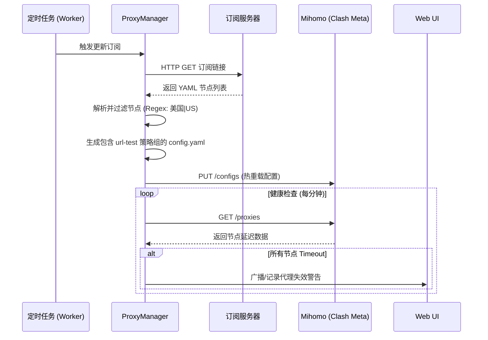
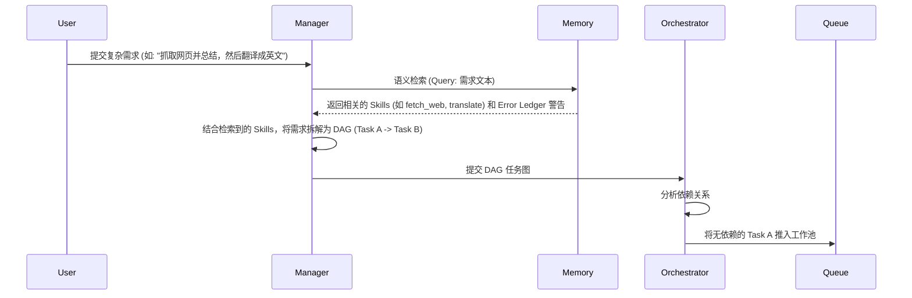
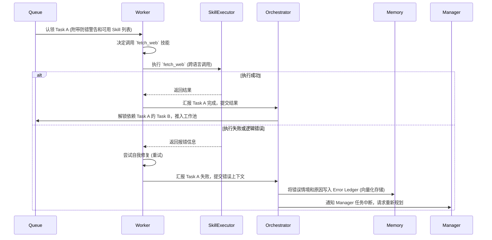
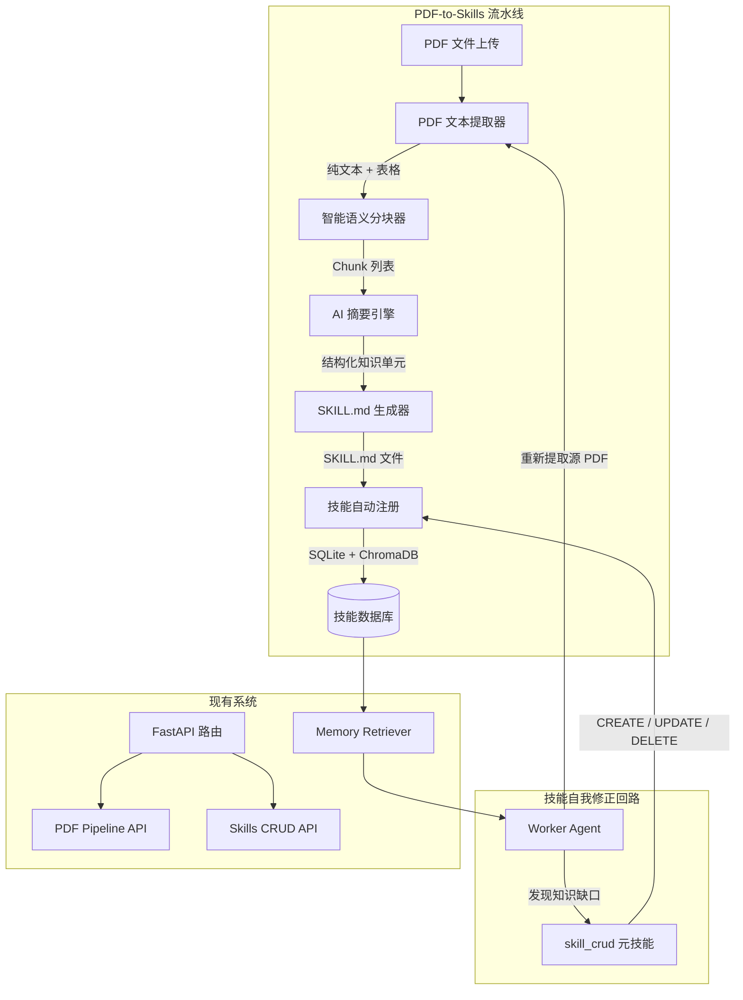
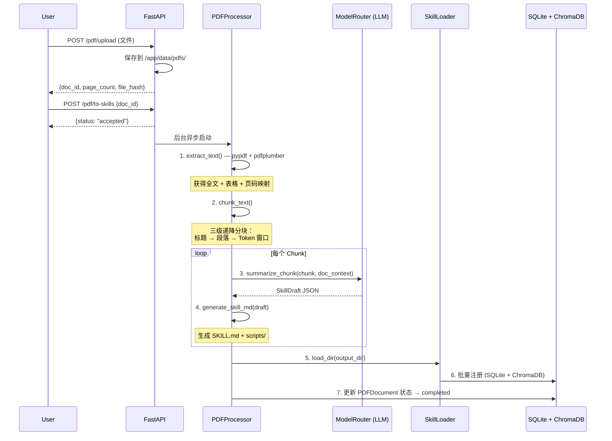
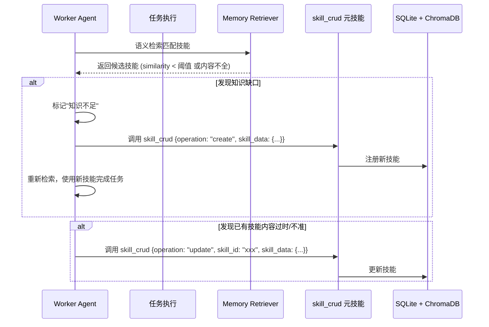

# Watery AI Agent - 架构设计文档 (Specs)


## 1. 功能需求 (Functional Requirements)


### 1.1 核心目标

构建一个高度自动化的个人 AI 代理系统，具备自我调度、自我纠错、自我生长的能力。系统采用“工作池”模式，支持图状依赖（DAG）任务拆解，并通过动态 API 路由选择最优模型。


### 1.2 关键特性 (Phase 2 & Beyond)

*   **工作池与编排 (Work Pool & Orchestrator)**：

    *   Manager Agent 负责意图理解、任务拆解（DAG），并将子任务推入队列。

    *   Worker Agents 异步并发认领并执行任务。

*   **按需检索的记忆网络 (RAG-based Memory)**：

    *   **技能库 (Skills)**、**错题集 (Error Ledger)**、**知识库 (Knowledge)** 必须以向量化或结构化的方式存储在数据库中。

    *   Manager Agent 在分配任务前，**仅通过语义检索 (Semantic Search)** 提取与当前任务高度相关的技能和防错提示，极大地降低 Token 消耗，避免上下文污染。

*   **多语言/跨平台技能执行 (Language-Agnostic Skills)**：

    *   技能不局限于 Python。系统支持执行 Shell 脚本、Node.js、Go 等任何可通过命令行或容器调用的可执行文件。

    *   每个技能拥有标准化的清单文件（Manifest，如 JSON/YAML），定义其输入参数、输出格式和执行引擎。


---


## 2. 技术栈 (Tech Stack)


*   **后端框架**: Python 3.11+, FastAPI (异步非阻塞)

*   **大模型接口**: 统一封装的 `AsyncOpenAI` 客户端 (支持 Volcengine, Gemini 等)

*   **关系型数据库**: SQLite (配合 SQLAlchemy/SQLModel) - 用于存储任务状态 (DAG)、技能元数据。

*   **向量数据库**: ChromaDB (轻量级，支持本地持久化) - 用于存储和检索 Skills 描述、Error Ledger 文本和知识库片段。

*   **网络代理 (Proxy Stack)**: Mihomo (Clash Meta) 容器化运行，专为 Gemini 等跨境 API 提供优选出的 Shadowsocks 2022 路由支持。

*   **任务队列**: `asyncio.Queue` (单机轻量级) 或 Redis (未来分布式扩展)。

*   **容器化**: Docker & Docker Compose。


---


## 3. 核心模块图 (Core Modules)


```mermaid

graph TD

    User[用户/前端/VSCode] -->|API Request| API[FastAPI 路由]

    API --> Manager[Manager Agent]

    

    subgraph Infrastructure [基础设施层]

        Clash[Mihomo/Clash Meta]

        API -->|Proxy Settings| Clash

        Clash -->|Routing| Gemini[Gemini API]

        API -->|Direct Connection| Volcengine[火山引擎 API]

    end

    

    subgraph Memory System [记忆与检索系统 (RAG)]

        VectorDB[(ChromaDB 向量库)]

        RelationalDB[(SQLite 关系库)]

        Retriever[Memory Retriever]

        Retriever -->|Semantic Search| VectorDB

        Retriever -->|Query Metadata| RelationalDB

    end

    

    Manager <-->|1. 检索相关技能与错题| Retriever

    Manager -->|2. 拆解任务 (DAG)| Orchestrator[Task Orchestrator]

    

    subgraph Work Pool [工作池]

        Queue[(Task Queue)]

        Orchestrator -->|3. 推送就绪任务| Queue

    end

    

    subgraph Execution Engine [执行引擎]

        Worker1[Worker Agent 1]

        Worker2[Worker Agent 2]

        Queue -->|4. 认领任务| Worker1

        Queue -->|4. 认领任务| Worker2

        

        SkillRunner[Skill Executor]

        Worker1 -->|调用| SkillRunner

        Worker2 -->|调用| SkillRunner

        

        SkillRunner -->|执行 .py| PythonEnv

        SkillRunner -->|执行 .sh| ShellEnv

        SkillRunner -->|执行 .js| NodeEnv

    end

    

    Worker1 -->|5. 返回结果/报错| Orchestrator

    Orchestrator -->|6. 更新错题集| Retriever

```


---


## 4. 数据库 Schema (Database Schema)


### 4.1 关系型数据库 (SQLite - SQLAlchemy)


*   **Task (任务表)**

    *   `id`: UUID (主键)

    *   `parent_id`: UUID (父任务ID，用于追踪归属)

    *   `description`: String (任务描述)

    *   `status`: Enum (PENDING, RUNNING, COMPLETED, FAILED)

    *   `dependencies`: JSON (依赖的任务 ID 列表)

    *   `result`: JSON (执行结果)

    *   `error_msg`: String (错误信息)


*   **SkillMetadata (技能元数据表)**

    *   `id`: String (技能唯一标识，如 `fetch_webpage`)

    *   `name`: String

    *   `language`: Enum (python, shell, nodejs, etc.)

    *   `entrypoint`: String (执行入口，如 `scripts/fetch.py`)

    *   `schema`: JSON (OpenAI Function Calling 格式的参数定义)


### 4.2 向量数据库 (ChromaDB Collections)


*   **Collection: `skills_vector`**

    *   `id`: 对应 `SkillMetadata.id`

    *   `document`: 技能的详细自然语言描述（用于语义匹配）

    *   `metadata`: `{"language": "python"}`

*   **Collection: `error_ledger_vector`**

    *   `id`: UUID

    *   `document`: 错误发生的上下文和具体表现

    *   `metadata`: `{"correction": "正确的做法说明", "related_skill": "skill_id"}`

*   **Collection: `knowledge_vector`**

    *   `id`: UUID

    *   `document`: 知识库文本块


---


## 5. 代理与网络子系统 (Proxy Subsystem)


### 5.1 架构设计

为了支持访问受限的 LLM API（如 Gemini, Claude），系统集成了一个独立的代理层。

*   **代理内核**: 使用 `metacubex/mihomo` (Clash Meta) 容器，以支持现代加密协议（如 `2022-blake3-aes-256-gcm`）。

*   **动态节点管理**: 

    *   `ProxyManager` (Python 服务) 定期拉取用户的订阅链接。

    *   解析 YAML 格式的节点列表，过滤出目标地区（如美国、日本）或特定名称的节点。

    *   利用 Mihomo 内置的 `url-test` 策略组，自动对过滤后的节点进行延迟测试，并始终将流量路由到延迟最低的可用节点。

*   **故障告警**: 

    *   通过 Mihomo 的 REST API (`http://clash:9090/proxies`) 监控 `url-test` 策略组的状态。

    *   如果所有节点均 `timeout`，则通过 `/api/v1/proxy/status` 接口向前端 Web UI 广播警告。


### 5.2 逻辑流 (Proxy Manager Flow)




---


## 6. 关键数据模型与接口 (Interfaces / Types)


```python

from pydantic import BaseModel, Field

from typing import List, Dict, Any, Optional

from enum import Enum


class TaskStatus(str, Enum):

    PENDING = "pending"

    RUNNING = "running"

    COMPLETED = "completed"

    FAILED = "failed"


class TaskNode(BaseModel):

    """DAG 中的任务节点"""

    id: str

    description: str

    dependencies: List[str] = Field(default_factory=list, description="必须先完成的任务 ID 列表")

    status: TaskStatus = TaskStatus.PENDING

    assigned_worker: Optional[str] = None

    result: Optional[Any] = None


class SkillManifest(BaseModel):

    """技能清单定义"""

    id: str

    name: str

    description: str

    language: str = Field(..., description="python, shell, nodejs 等")

    entrypoint: str = Field(..., description="相对路径或执行命令")

    parameters: Dict[str, Any] = Field(..., description="JSON Schema 格式的参数定义")


class MemoryQuery(BaseModel):

    """记忆检索请求"""

    task_description: str

    top_k_skills: int = 3

    top_k_errors: int = 2


class MemoryContext(BaseModel):

    """检索返回的上下文，注入给 Worker"""

    relevant_skills: List[SkillManifest]

    error_warnings: List[str]

```


---


## 6. 复杂业务逻辑流 (Logic Flow)


### 6.1 Manager Agent 任务拆解与分发流程





### 6.2 Worker Agent 执行与纠错流程





---

## 7. 实现注记与已知约束 (Implementation Notes)

### 7.1 Worker 并发规模
当前系统启动时并发运行 **3 个** Worker（Worker-01 ~ Worker-03）。每个 Worker 独立监听同一个 `asyncio.Queue`，原生支持 DAG 中无依赖关系的任务分支并行执行。Worker 数量可在 `app/main.py` 的启动循环中调整。

### 7.2 任务队列持久化与启动恢复（Queue Recovery）
`asyncio.Queue` 是纯内存结构，服务重启（包括 `uvicorn --reload` 热重载）后队列内容**完全丢失**，在途任务会永久卡在 PENDING/RUNNING 状态。

**解决方案**：`Orchestrator.recover_pending_tasks()` 在每次应用启动时（`main.py` 的 `lifespan` 钩子中）自动执行以下步骤：
1. 将 SQLite 中状态为 `RUNNING` 的任务重置为 `PENDING`（Worker 在重启前未来得及完成的任务）。
2. 扫描所有 `PENDING` 任务，将依赖条件已满足（所有前置任务均为 `COMPLETED`）的任务重新推入 `asyncio.Queue`。

### 7.3 Task ID 唯一性
Manager Agent 通过 LLM 生成任务 DAG 时，模型倾向于输出 `task_1`、`task_2` 等人类可读的固定 ID。若用户多次提交意图，这些 ID 会在 SQLite 中产生 `UNIQUE constraint failed` 冲突。

**解决方案**：在 `manager.py` 中，LLM 返回 DAG 后立即用 `uuid.uuid4()` 为每个任务生成全局唯一 ID，并通过 `id_map` 字典同步替换所有 `dependencies` 中的引用，再执行数据库写入。

### 7.4 内部 HTTP 请求与代理环境变量隔离
容器内若存在 `HTTP_PROXY` / `HTTPS_PROXY` 环境变量（由 Docker 从宿主机继承），`httpx` 默认会将所有请求（包括 `http://clash:9090` 等 Docker 内网地址）路由到宿主机代理，导致 502 错误。

**解决方案**：所有面向 Docker 内网的 `httpx.AsyncClient` 调用均设置 `trust_env=False`，强制绕过环境变量代理。


---

## 8. Phase 3 —— 问题诊断与解决方案规划 (Phase 3 Roadmap)

> **生成背景**：本章节为 2026-02-22 全量代码审计后，在 [ARCHITECT] 模式下输出的正式规划报告。  
> 它覆盖了从 Phase 1~2 遗留的所有架构级问题，并给出了优先级排序和解决方案设计。

---

### 8.1 需求缺口矩阵 (Requirement Gap Matrix)

| 需求文档要求 | 当前状态 | 缺口描述 |
|---|---|---|
| Worker 真正执行 Skill 脚本 | ❌ 核心缺失 | `executor.py` 完整实现但**从未被调用**，Worker 只用 LLM 口头"模拟执行" |
| Skills 库自动生成与注册 | ❌ 未实现 | 数据模型有，无写入 API，Worker 不知道有哪些技能可用 |
| Error Ledger 自动写入 | ⚠️ 仅人工 | Worker 失败时**不会自动**调用 `memory_retriever.add_error_entry()` |
| 任务失败级联通知 | ❌ 未实现 | 下游任务因上游失败永远卡在 PENDING（死锁） |
| Manager 上下文传递给 Worker | ⚠️ 缺失一半 | Manager 检索了 Skills/Errors，但仅注入给自己的 Prompt，未传给认领任务的 Worker |
| 动态模型路由 Fallback | ⚠️ 缺失 | 某个 Provider 挂掉时无自动切换逻辑 |
| Git 跨端同步 | ❌ 未实现 | 需求文档有提及，系统无任何 Git 操作能力 |
| VSCode 插件 / 手机端鉴权 | ⚠️ API 可用但无鉴权 | 所有接口完全公开，无 Token/API Key 机制 |

---

### 8.2 P0 级问题——核心功能断裂

#### 问题 P0-1：Worker 是"执行空壳"

**文件**：`app/services/worker.py`  
**现象**：用户提交任务后，后端只是把任务描述丢给 LLM 让它"口头回答"，没有任何实际代码被运行。  
**根因**：`executor.py` 中实现了完整的跨语言脚本执行引擎（Python/Shell/Node.js），但 `worker.py` 中有一行 `# TODO: 真正执行 Skill (如果存在匹配的 Skill)` 标记了这个断层，从未被填充。  
**影响**：系统整体执行能力为零——所有看起来"完成"的任务都只是 LLM 的文字回复，而非真实产出。

**解决方案设计**：

```
Worker.execute_task(task) 的新执行流程：

1. 查询 SkillMetadata 表和 skills_vector，
   用任务描述做语义检索，得到候选 Skill 列表。

2. 如果 top-1 技能相似度 >= 阈值（如 0.75）：
   a. 从 SkillMetadata 取 language + entrypoint
   b. 调用 SkillExecutor.run(language, entrypoint, params)
   c. 返回真实执行结果

3. 如果无匹配技能（相似度 < 阈值）：
   a. Fallback：调用 LLM 进行推理
   b. （可选）LLM 推理后自动生成新 Skill 脚本 + 注册
```

**涉及改动文件**：`worker.py`（添加技能匹配逻辑）、`executor.py`（添加超时控制）

---

#### 问题 P0-2：任务失败无级联处理，下游任务永远 PENDING

**文件**：`app/services/orchestrator.py`  
**现象**：任务 A 失败 → 任务 B、C（依赖 A）无法被触发 → 永远等待 → 系统无任何报错，用户只看到任务板停止更新。  
**根因**：`orchestrator.py` 的 `fail_task()` 方法只标记当前任务为 FAILED，没有任何语句通知或处理其下游依赖任务。  
**影响**：产生隐式死锁——用户无从知晓任务链卡在哪里，只能手动查数据库。

**解决方案设计**：

```python
# orchestrator.py — fail_task() 新增级联逻辑

async def fail_task(self, task_id: str, error_msg: str):
    # 1. 标记当前任务 FAILED（现有逻辑不变）
    ...

    # 2. 级联：将所有依赖此任务的 PENDING 下游任务标记为 FAILED
    with Session(engine) as s:
        pending = s.exec(select(Task).where(Task.status == TaskStatus.PENDING)).all()
        for t in pending:
            if task_id in (t.dependencies or []):
                # 递归级联，传播失败链
                await self.fail_task(t.id, f"上游任务 {task_id} 失败，级联终止")

    # 3. 触发 Error Ledger 自动写入
    await memory_retriever.add_error_entry(
        context=f"任务描述: {task.description}\n错误: {error_msg}",
        correction="参考任务描述和错误信息，改进执行策略或 Skill 选择"
    )
```

---

#### 问题 P0-3：Skills 系统完全未闭环

**现象**：`SkillMetadata` 表存在但始终为空；`skills_vector` ChromaDB 集合无数据；Worker 无技能可用。  
**根因**：
- 无创建/注册技能的 API（只有 `GET /api/v1/skills`，无 `POST`）
- `init_memory.py` 初始化脚本只写了样例数据，未被集成进正式流程
- `skills_vector` 向量集合的 `add_skill()` 方法存在但无任何调用路径

**解决方案设计**：

```
新增 API：POST /api/v1/skills
请求体：{
  "id": "fetch_webpage",
  "name": "抓取网页",
  "language": "python",
  "entrypoint": "scripts/skills/fetch_webpage.py",
  "description": "...",      <- 用于向量化写入 ChromaDB
  "parameters_schema": {...} <- OpenAI Function Calling 格式
}

处理逻辑：
1. 写入 SQLite SkillMetadata 表
2. 同时写入 ChromaDB skills_vector 集合（用 description 做向量化）
3. 将脚本内容写入 /app/scripts/skills/{entrypoint}

同步提供：
  GET    /api/v1/skills/{id}  — 获取技能详情
  DELETE /api/v1/skills/{id}  — 同步删除 SQLite + ChromaDB
```

---

### 8.3 P1 级问题——稳定性隐患

#### 问题 P1-1：`asyncio.create_task()` 无引用持有，Worker 可能被 GC 静默取消

**文件**：`app/main.py`（启动 Worker）、`app/api/routes.py`（`/intention` 端点）  
**现象**：极低概率下，后台任务被 Python GC 回收，协程在中途被静默取消，无任何日志或异常。  

**解决方案**：

```python
# main.py — 修复方式
background_tasks: set = set()

async def startup():
    for i in range(1, 4):
        w = WorkerAgent(name=f"Worker-{i:02d}")
        t = asyncio.create_task(w.start())
        background_tasks.add(t)
        t.add_done_callback(background_tasks.discard)

# routes.py — /intention 端点同理
t = asyncio.create_task(manager_agent.process_intention(req.intention))
background_tasks.add(t)
t.add_done_callback(background_tasks.discard)
```

---

#### 问题 P1-2：ChromaDB 同步 API 在 async 函数中阻塞事件循环

**文件**：`app/services/memory_retriever.py`  
**现象**：ChromaDB 的 `.add()` / `.query()` 是同步阻塞调用，被 Worker 或 Manager 通过 `await` 间接调用时，会霸占 asyncio 事件循环，导致 API 响应出现延迟。  

**解决方案**：使用 `asyncio.get_event_loop().run_in_executor()` 将同步调用推入线程池：

```python
import asyncio
from functools import partial

async def add_skill(self, skill: SkillManifest) -> None:
    loop = asyncio.get_event_loop()
    await loop.run_in_executor(
        None,
        partial(self.skills_col.add,
                documents=[skill.description],
                ids=[skill.id],
                metadatas=[{"language": skill.language}])
    )
```

---

#### 问题 P1-3：配置项分散，`proxy_manager.py` 绕过 Pydantic Settings

**文件**：`app/services/proxy_manager.py`、`app/core/config.py`  
**现象**：`SUB_URL`、`CLASH_API_URL`、`PROXY_URL` 等关键配置通过 `os.getenv()` 直接读取，不受 Pydantic 类型检查和默认值管理，缺失时无明确错误提示。

**解决方案**：在 `config.py` 的 `Settings` 类中补入：

```python
class Settings(BaseSettings):
    # ... existing fields ...
    clash_api_url: str = "http://clash:9090"
    proxy_url: str = "http://clash:7890"
    subscription_url: Optional[str] = None  # 未配置时 ProxyManager 跳过订阅更新
    proxy_region_filter: str = "美国|US"    # 节点过滤关键词（正则）
```

---

### 8.4 P2 级问题——可观测性与工程健壮性

#### 问题 P2-1：Task 模型缺少时间戳

**文件**：`app/models/database.py`  
**影响**：无法统计任务耗时；前端任务看板无法显示创建/完成时间。  
**解决方案**：在 `Task` 模型中新增 `created_at` / `updated_at` 字段，在 Orchestrator 的状态变更点更新 `updated_at`。

---

#### 问题 P2-2：无优雅关闭机制（Graceful Shutdown）

**文件**：`app/main.py`  
**影响**：`docker-compose down` 时进行中的 Worker 被强制中断，任务永久停在 RUNNING（需要下次 `recover_pending_tasks` 才能恢复）。  
**解决方案**：迁移到 `lifespan` 上下文管理器，shutdown 阶段 cancel 所有 background tasks。这同时解决 `@app.on_event("startup")` 废弃警告。

---

#### 问题 P2-3：`Watery/` 子目录为历史快照，已大幅落后根目录

**现象**：`Watery/` 中缺失 UUID 映射、Queue Recovery、多 Worker、trust_env 修复、前端模态框等所有 Phase 2 改动。  
**解决方案**：直接删除 `Watery/` 目录，加入 `.gitignore`。

---

#### 问题 P2-4：`pyyaml` 未列为显式依赖

**文件**：`requirements.txt`  
**现象**：`proxy_manager.py` 使用 `yaml.safe_load` / `yaml.dump`，但 `pyyaml` 不在 `requirements.txt` 中，依赖靠 chromadb 传递引入，不可靠。  
**解决方案**：追加 `pyyaml>=6.0.1`。

---

### 8.5 Phase 3 实施路线图

```
Phase 3a — 执行引擎闭环（让系统真正"能做事"）
├── 3a-1  Worker <-> Executor 集成
│         worker.py 添加语义技能匹配 -> 调用 SkillExecutor
│         executor.py 添加 timeout 参数（默认 30s）
├── 3a-2  Skills CRUD API
│         POST /api/v1/skills — 写入 SQLite + ChromaDB
│         DELETE /api/v1/skills/{id} — 同步删除
│         前端"🛠️ 技能库"模态框添加注册表单
├── 3a-3  任务失败级联 + Error Ledger 自动写入
│         orchestrator.fail_task() 添加递归级联逻辑
│         Worker 失败路径调用 memory_retriever.add_error_entry()
└── 3a-4  Manager -> Worker 上下文传递
          task 对象中嵌入 relevant_skills 和 error_warnings
          Worker 执行前解析这些提示作为执行策略参考

Phase 3b — 工程加固（让系统"稳定运行"）
├── 3b-1  asyncio.create_task 引用持有（main.py + routes.py）
├── 3b-2  ChromaDB 同步调用迁移到 run_in_executor
├── 3b-3  配置项统一迁移至 Pydantic Settings（proxy_manager.py）
├── 3b-4  Task 模型添加 created_at / updated_at 时间戳
├── 3b-5  lifespan 上下文管理器 + 优雅关闭
├── 3b-6  删除 Watery/ 子目录 + 补齐 pyyaml 显式依赖
└── 3b-7  ModelRouter 添加 Provider 级别 Fallback 逻辑
```

---

### 8.6 各问题执行优先级汇总

| 编号 | 问题 | 优先级 | 估算改动量 | 风险 |
|---|---|---|---|---|
| P0-1 | Worker 不调用 SkillExecutor | 🔴 高 | worker.py ~50行 | 中 |
| P0-2 | 失败任务无级联处理 | 🔴 高 | orchestrator.py ~20行 | 低 |
| P0-3 | Skills 系统未闭环 | 🔴 高 | routes.py + memory_retriever.py ~60行 | 中 |
| P1-1 | create_task 无引用持有 | 🟠 中 | main.py + routes.py ~10行 | 低 |
| P1-2 | ChromaDB 阻塞事件循环 | 🟠 中 | memory_retriever.py ~30行 | 低 |
| P1-3 | 配置项分散 | 🟠 中 | config.py + proxy_manager.py ~20行 | 低 |
| P2-1 | 缺少时间戳字段 | 🟡 低 | database.py + orchestrator.py ~15行 | 低（需迁移数据库） |
| P2-2 | 无优雅关闭 | 🟡 低 | main.py ~30行 | 低 |
| P2-3 | Watery/ 旧拷贝 | 🟡 低 | 删除目录 | 无 |
| P2-4 | pyyaml 依赖缺失 | 🟡 低 | requirements.txt 1行 | 无 |

---

## 9. Phase 4 —— PDF-to-Skills 智能文档学习系统 (2026-02-24)

> **目标**：构建一条 **PDF → 语义分块 → AI 总结 → 技能封装 → 自动注册** 的全自动流水线。
> 系统能将任意 PDF 专业文档（书籍、手册、报告）自动转化为 Anthropic Skills 协议格式的可调用技能包，
> 并支持在后续使用过程中 **自我发现知识缺口 → 自主补充 Skills 库** 的闭环。

### 9.1 需求分析

#### 来源
- 参考文章 1：[Claude Skills 硬核技巧：用 PDF-Skill 10 分钟搞定全类型 PDF 自动化](https://mp.weixin.qq.com/s/-xBn1qRyfHtL50tJXopHVQ)
  - 核心：ModelScope ms-agent/PDF-Skill 工具包的使用方式；pypdf / pdfplumber / reportlab 技术栈
- 参考文章 2：[pdf2skill：一键将专业书籍转换成 AI 技能](https://mp.weixin.qq.com/s/Bxf2-rwbNwKNpsERlWGxYQ)
  - 核心：语义拆解、逻辑建模、技能封装、路由索引生成的设计理念

#### 功能需求

| 需求 | 描述 | 优先级 |
|---|---|---|
| PDF 文本提取 | 支持文字型和扫描型 PDF 的全文提取 + 表格识别 | P0 |
| 智能语义分块 | 基于标题层级 / Token 预算自适应分块，非机械分页 | P0 |
| AI 摘要 + 结构化 | 对每个 Chunk 调用 LLM 提取：概念、步骤、触发条件、输入输出 | P0 |
| SKILL.md 自动生成 | 按 Anthropic Skills 协议输出 YAML frontmatter + Markdown 正文 | P0 |
| 自动注册到系统 | 生成后调用 `POST /skills` 写入 SQLite + ChromaDB | P0 |
| 技能自我修正 (Self-Amendment) | Agent 运行中发现知识缺口 → 调用 `skill_crud` 技能自主补充 | P1 |
| PDF 文档溯源 | 记录每个 Skill 的来源 PDF + 页码范围，便于查证 | P1 |
| 技能更新（PUT） | 支持 `PUT /skills/{id}` 就地更新已有技能 | P1 |
| 批量 PDF 处理 | 支持目录级批量导入 | P2 |

---

### 9.2 系统架构拓展



---

### 9.3 新增模块设计

#### 9.3.1 `app/services/pdf_processor.py` — PDF 处理核心服务

```python
class PDFProcessor:
    """
    PDF 文档处理流水线，负责：
    1. 文本提取（pypdf 基础文本 + pdfplumber 表格）
    2. 语义分块（基于标题层级 + Token 预算）
    3. AI 结构化摘要（每个 Chunk → 知识单元）
    4. SKILL.md 文件生成
    """

    # ---------- 提取层 ----------
    async def extract_text(
        self, pdf_path: str
    ) -> PDFExtractResult:
        """
        提取 PDF 全文文本和表格数据。
        Returns:
            PDFExtractResult {
                text: str,           # 全文纯文本
                pages: list[PageContent],  # 每页文本 + 表格
                page_count: int,
                metadata: dict       # 标题、作者等元数据
            }
        """

    # ---------- 分块层 ----------
    def chunk_text(
        self,
        pages: list[PageContent],
        max_tokens: int = 6000,
        overlap_tokens: int = 200,
    ) -> list[TextChunk]:
        """
        智能语义分块策略（3 级递降）：
        Level 1: 按 Markdown 风格标题 (# / ## / ###) 切分章节
        Level 2: 若章节仍超 max_tokens，按段落 (双换行) 切分
        Level 3: 若段落仍超长，按 Token 窗口滑动切分（带 overlap）

        每个 Chunk 携带：
            - chunk_id: str
            - text: str
            - source_pages: list[int]   # 来源页码
            - heading_path: list[str]   # 层级标题路径 ["第三章", "3.2 xxx"]
        """

    # ---------- 摘要层 ----------
    async def summarize_chunk(
        self, chunk: TextChunk, doc_context: str = ""
    ) -> SkillDraft:
        """
        调用 LLM（经 ModelRouter）对单个 Chunk 生成结构化技能草案。

        Prompt 模板要求 LLM 输出 JSON：
        {
            "skill_name": "xxx",
            "description": "一句话描述",
            "trigger_conditions": ["当用户问到…时"],
            "execution_logic": "分步操作流程（Markdown）",
            "input_parameters": {...},
            "output_format": "期望输出格式",
            "dependencies": ["前置知识/技能ID"],
            "tags": ["领域标签"]
        }
        """

    # ---------- 生成层 ----------
    def generate_skill_md(
        self, draft: SkillDraft, skill_id: str, output_dir: str
    ) -> str:
        """
        将 SkillDraft 转化为 Anthropic Skills 协议的目录结构：
            {output_dir}/{skill_id}/
            ├── SKILL.md     # YAML frontmatter + Markdown
            └── scripts/     # 若有可执行脚本
                └── main.py

        Returns: 生成的 SKILL.md 文件路径
        """

    # ---------- 全流水线 ----------
    async def pdf_to_skills(
        self,
        pdf_path: str,
        output_dir: str = "/app/skills",
        skill_prefix: str = "",
        max_tokens_per_chunk: int = 6000,
    ) -> PipelineResult:
        """
        完整流水线：PDF → 提取 → 分块 → 摘要 → 生成 → 注册
        Returns:
            PipelineResult {
                pdf_path: str,
                total_pages: int,
                total_chunks: int,
                skills_generated: list[str],  # 技能 ID 列表
                skills_registered: int,
                errors: list[str]
            }
        """
```

#### 9.3.2 `skills/pdf_extract_text/` — PDF 文本提取技能

```yaml
# SKILL.md frontmatter
---
name: PDF 文本提取
description: 从 PDF 文件中提取纯文本内容和表格数据，支持多页PDF，输出结构化JSON
language: python
entrypoint: scripts/main.py
parameters_schema:
  type: object
  properties:
    pdf_path:
      type: string
      description: PDF 文件的绝对路径
    extract_tables:
      type: boolean
      description: 是否同时提取表格（默认 true）
    page_range:
      type: string
      description: "页码范围，如 '1-5' 或 '1,3,5'（默认全部）"
  required: [pdf_path]
tags: [pdf, extraction, document]
---
```

#### 9.3.3 `skills/pdf_to_skills/` — PDF 转技能流水线技能

```yaml
---
name: PDF 转技能包
description: |
  将一个 PDF 文档自动转化为一组可调用的 AI 技能。
  流程：提取文本 → 语义分块(按标题/段落/Token窗口三级递降) →
  调用 LLM 结构化摘要 → 生成 SKILL.md → 注册到技能库。
  适用于专业书籍、操作手册、行业报告、技术规范。
language: python
entrypoint: scripts/main.py
parameters_schema:
  type: object
  properties:
    pdf_path:
      type: string
      description: 待处理的 PDF 文件路径
    skill_prefix:
      type: string
      description: 生成技能 ID 的前缀（如 'finance_' → 'finance_xxx'）
    max_tokens_per_chunk:
      type: integer
      description: 每个语义块的最大 Token 数（默认 6000）
    output_dir:
      type: string
      description: 生成的 SKILL.md 输出目录（默认 /app/skills）
  required: [pdf_path]
tags: [pdf, skill-generation, pipeline, knowledge]
---
```

#### 9.3.4 `skills/skill_crud/` — 技能库自修正元技能

```yaml
---
name: 技能库管理
description: |
  用于创建、更新、删除技能库中的技能。这是一个元技能(meta-skill)，
  允许 AI Agent 在运行过程中发现知识缺口时自主补充技能库，
  或在发现已有技能内容不全/不准确时进行修正。
  支持 create / update / delete 三种操作。
language: python
entrypoint: scripts/main.py
parameters_schema:
  type: object
  properties:
    operation:
      type: string
      enum: [create, update, delete]
      description: "操作类型"
    skill_id:
      type: string
      description: "技能 ID（update/delete 必填）"
    skill_data:
      type: object
      description: "技能数据（create/update 时提供）"
      properties:
        name: { type: string }
        description: { type: string }
        language: { type: string }
        entrypoint: { type: string }
        parameters_schema: { type: object }
        content: { type: string, description: "技能正文/执行逻辑" }
  required: [operation]
tags: [meta, self-amendment, skills-management]
---
```

---

### 9.4 数据库 Schema 扩展

#### 新增表 `PDFDocument` — PDF 文档溯源

```python
class PDFDocument(SQLModel, table=True):
    """记录已处理的 PDF 文档及其处理结果。"""
    id: str = Field(default_factory=lambda: str(uuid.uuid4()), primary_key=True)
    filename: str                     # 原始文件名
    file_path: str                    # 容器内存储路径
    file_hash: str = Field(index=True)  # SHA-256 哈希（幂等去重）
    page_count: int = 0
    total_chunks: int = 0
    skills_generated: List[str] = Field(default_factory=list, sa_column=Column(JSON))
    status: str = "pending"           # pending / processing / completed / failed
    error_msg: Optional[str] = None
    created_at: Optional[datetime] = Field(default_factory=datetime.utcnow)
    completed_at: Optional[datetime] = None
```

---

## 10. Phase 5 — ms-agent 深度能力集成（已实现 2026-02-24）

### 10.1 架构概述

在不侵入 Skills 系统的前提下，通过 `MSAgentService` 服务层直接调用 ms-agent CLI 子进程，
为系统注入两种高级能力：

- **deep_research**：多轮迭代式深度研究，输出 Markdown 研究报告
- **code_genesis**：7 阶段 DAG 代码生成工作流（设计→编码→精炼→测试）

### 10.2 核心服务：MSAgentService

```python
class MSAgentService:
    async def run_deep_research(query, max_rounds=6) -> {"task_id": str}
    async def run_code_genesis(query, language="python") -> {"task_id": str}
    def get_task_status(task_type, task_id) -> MSAgentTaskStatus
    def list_tasks(task_type, limit=20) -> List[MSAgentTaskListItem]
```

### 10.3 API 端点

| 方法 | 路径 | 说明 |
|------|------|------|
| POST | `/api/v1/ms-agent/research` | 启动深度研究任务 |
| GET | `/api/v1/ms-agent/tasks/research/{id}` | 查询研究任务状态/报告 |
| POST | `/api/v1/ms-agent/code` | 启动代码生成任务 |
| GET | `/api/v1/ms-agent/tasks/code/{id}` | 查询代码任务状态/输出 |
| GET | `/api/v1/ms-agent/tasks?type=research\|code` | 列出任务 |

---

## 11. Phase 6 — Chat Tool Calling + Worker 自我改进 + 前端增强（已实现 2026-02-24）

### 11.1 Chat Tool Calling（组 A）

#### 架构模式

```
用户消息 → chat_endpoint → ToolRegistry 获取工具定义
    → ModelRouter.generate(tools=...) → LLM 返回 tool_calls
    → SkillExecutor 执行每个 tool_call → 结果追加为 role=tool 消息
    → 循环（最多 5 轮）→ LLM 生成最终回复（附带 tool_results）
```

#### 核心组件

**ToolRegistry** (`app/services/tool_registry.py`)
- `get_tool_definitions()` → OpenAI function calling 格式的工具列表
- `get_tool_by_name(name)` → SkillMetadata 查找
- 30s TTL 缓存，CRUD 操作时主动 `invalidate_cache()`

**ModelRouter 升级**
- `generate()` 新增 `tools: Optional[List[Dict]]` + `tool_choice: str` 参数
- 新增 `_format_messages()` 静态方法：正确序列化 role=tool / tool_calls / content=None
- 新增 `_extract_tool_calls()` 静态方法：从 OpenAI SDK 响应提取 ToolCall 对象
- Volcengine + Gemini 双 Provider 均支持 Tool Calling

**Schema 扩展**
- `ToolCallFunction(name, arguments)` / `ToolCall(id, type, function)`
- `Message.content` → Optional（LLM 返回 tool_calls 时 content=null）
- `ChatResponse` 新增 `tool_calls`、`tool_results`、`finish_reason`

### 11.2 Worker 自我改进（组 B）

#### B-1: 异步深度研究触发

当 Worker 检测到知识缺口（ChromaDB L2 距离 > 1.5 或无匹配技能）时，
Fire-and-forget 调用 `ms_agent_service.run_deep_research()`，
将 `task_id` 存入模块级 `_pending_amendments` 字典。

仅 Worker-01 运行 `_poll_amendment_tasks()` 后台循环（每 60s 轮询），
避免多 Worker 重复处理。

#### B-2: 报告→技能蒸馏器

研究完成后 `_distill_report_to_skills()` 自动执行：
1. 将报告全文注册为 `skill_type="knowledge"` 文档型技能（立即可 RAG 检索）
2. 调用 LLM 从报告中提炼 1-3 个 `skill_type="executable"` 可执行技能草案
3. 自动写入脚本文件、注册 SQLite + ChromaDB、刷新 ToolRegistry 缓存

#### B-3: 知识型技能注入

`SkillMetadata` 新增 `skill_type`（"executable" | "knowledge"）和 `knowledge_content` 字段。

Worker 执行任务时：
- `skill_type="executable"` → 调用 SkillExecutor 执行脚本（原有逻辑）
- `skill_type="knowledge"` → 将 `knowledge_content` 注入 LLM system prompt 作为上下文

### 11.3 前端增强（组 C）

#### C-1: 工具调用可视化

- `.tool-call-card` CSS 样式（蓝色边框标注成功、红色标注失败）
- `appendMessageWithTools(role, content, toolResults)` 函数
- `sendMessage()` 读取 `ChatResponse.tool_results` 并渲染到聊天气泡中

#### C-2: 右侧侧栏三 Tab 看板

| Tab | 内容 | 数据源 |
|-----|------|--------|
| 📋 任务 | 原有任务看板（5s 轮询） | `GET /api/v1/tasks` |
| 🔬 研究 | deep_research 任务列表 + 新建/详情 | `GET /api/v1/ms-agent/tasks?type=research` |
| 💻 代码 | code_genesis 任务列表 + 新建/详情 | `GET /api/v1/ms-agent/tasks?type=code` |
#### 扩展 `SkillMetadata` — 新增溯源字段

```python
# 新增字段（ALTER TABLE 平滑升级）
source_pdf_id: Optional[str] = None        # 来源 PDF 文档 ID
source_pages: Optional[str] = None         # 来源页码范围，如 "12-18"
tags: List[str] = Field(default_factory=list, sa_column=Column(JSON))
```

---

### 9.5 新增 API 端点

```
POST /api/v1/pdf/upload          上传 PDF 文件到服务器
POST /api/v1/pdf/to-skills       触发 PDF → Skills 流水线（异步）
GET  /api/v1/pdf/status/{doc_id} 查询流水线处理进度
PUT  /api/v1/skills/{skill_id}   更新已有技能（技能自修正核心）
```

#### `POST /api/v1/pdf/upload`

```
Content-Type: multipart/form-data
Body: file = <PDF 二进制>
Response: {
    "doc_id": "uuid",
    "filename": "xxx.pdf",
    "file_path": "/app/data/pdfs/xxx.pdf",
    "page_count": 320,
    "file_hash": "sha256..."
}
```

#### `POST /api/v1/pdf/to-skills`

```json
{
    "doc_id": "uuid（来自 upload 返回）",
    // —— 或直接指定路径 ——
    "pdf_path": "/app/data/pdfs/xxx.pdf",
    "skill_prefix": "finance_",
    "max_tokens_per_chunk": 6000,
    "output_dir": "/app/skills"
}
```

> 此接口为**异步**接口，立即返回 `{"status": "accepted", "doc_id": "..."}` 
> 流水线在后台执行，通过 `GET /pdf/status/{doc_id}` 查询进度。

#### `PUT /api/v1/skills/{skill_id}`

```json
{
    "name": "新名称（可选）",
    "description": "新描述（可选）",
    "language": "python（可选）",
    "entrypoint": "scripts/xxx.py（可选）",
    "parameters_schema": { ... },
    "script_content": "新脚本内容（可选）"
}
```

> 仅更新提供的字段（PATCH 语义），同步更新 SQLite + ChromaDB。

---

### 9.6 核心逻辑流

#### 9.6.1 PDF-to-Skills 全流水线



#### 9.6.2 技能自我修正流程



---

### 9.7 智能分块策略详细设计

PDF 文档分块是整个流水线的 **关键瓶颈点**，直接决定生成技能的质量。

#### 三级递降分块算法

```
输入：pages: list[PageContent]（每页的文本 + 页码）
输出：chunks: list[TextChunk]

Step 1 — 标题层级切分（优先）
    扫描全文，识别 Markdown 风格标题（# / ## / ###）
    或 PDF 原生大字号/粗体标题（通过 pdfplumber 的 char 信息推断）
    按一级标题(#)切分为大章节

Step 2 — Token 预算检查
    FOR each section:
        IF token_count(section) <= max_tokens:
            → 直接作为一个 Chunk
        ELIF section 有子标题(## / ###):
            → 按子标题再切分，递归 Step 2
        ELSE:
            → 进入 Step 3

Step 3 — 滑动窗口切分
    FOR each 超长文本段:
        按 max_tokens 窗口滑动，overlap = overlap_tokens
        确保段落完整性（不在句子中间截断）

后处理：
    - 表格保持完整，不跨 Chunk 拆分
    - 每个 Chunk 标注 heading_path（章节层级路径）
    - 每个 Chunk 标注 source_pages（来源页码列表）
```

#### Token 计数策略

```python
def estimate_tokens(text: str) -> int:
    """
    快速 Token 估算（无需加载 tokenizer）：
    - 中文：约 1.5 个字符 ≈ 1 token
    - 英文：约 4 个字符 ≈ 1 token
    - 混合时取加权平均
    """
```

---

### 9.8 新增依赖

```
# requirements.txt 追加
pypdf>=4.0.0               # PDF 基础文本提取
pdfplumber>=0.11.0          # PDF 表格识别 + 高级文本提取
python-multipart>=0.0.6     # FastAPI 文件上传支持
```

> **注意**：本方案 **不引入** OCR (tesseract/pytesseract)、image 处理 (pypdfium2) 和
> 系统级命令行工具 (poppler-utils/qpdf/pdftk)。
> 理由：① 容器体积膨胀；② 主流 PDF 书籍/手册均为文字型。
> 如果后续需要扫描型 PDF 支持，在 Phase 5 中以可选插件方式引入。

---

### 9.9 目录结构变更

```
watery/
├── app/
│   ├── services/
│   │   ├── pdf_processor.py     # 【新增】PDF 处理核心服务
│   │   ├── skill_loader.py      # 已有，复用
│   │   ├── executor.py          # 已有，复用
│   │   └── ...
│   ├── api/
│   │   └── routes.py            # 新增 /pdf/* 端点 + PUT /skills/{id}
│   └── models/
│       ├── database.py          # 新增 PDFDocument 表
│       └── schemas.py           # 新增 PDFExtractResult, TextChunk, SkillDraft 等
├── skills/
│   ├── hello_world/             # 已有
│   ├── run_python_snippet/      # 已有
│   ├── pdf_extract_text/        # 【新增】PDF 文本提取技能
│   │   ├── SKILL.md
│   │   └── scripts/main.py
│   ├── pdf_to_skills/           # 【新增】PDF→Skills 流水线技能
│   │   ├── SKILL.md
│   │   └── scripts/main.py
│   └── skill_crud/              # 【新增】技能库自修正元技能
│       ├── SKILL.md
│       └── scripts/main.py
├── data/
│   ├── pdfs/                    # 【新增】上传的 PDF 存储目录
│   └── generated_skills/        # 【新增】流水线生成的临时技能目录
└── ...
```

---

### 9.10 Docker 配置变更

```yaml
# docker-compose.yml — 新增 Volume 挂载
services:
  api:
    volumes:
      - ./data:/app/data          # 已有
      - ./skills:/app/skills      # 已有
      - ./data/pdfs:/app/data/pdfs  # 【新增】PDF 存储持久化
```

---

### 9.11 Phase 4 实施路线图

```
Phase 4a — PDF 提取与分块（让系统"能读 PDF"）
├── 4a-1  新增 pypdf + pdfplumber 依赖，更新 Dockerfile
├── 4a-2  实现 PDFProcessor.extract_text()
├── 4a-3  实现 PDFProcessor.chunk_text() 三级递降分块算法
├── 4a-4  新增 PDFDocument 数据模型 + DB Migration
├── 4a-5  实现 POST /pdf/upload 文件上传端点
└── 4a-6  创建 pdf_extract_text 技能目录 + SKILL.md + scripts/main.py

Phase 4b — AI 摘要与技能生成（让系统"能学 PDF"）
├── 4b-1  设计 LLM Prompt 模板（Chunk → SkillDraft JSON）
├── 4b-2  实现 PDFProcessor.summarize_chunk()
├── 4b-3  实现 PDFProcessor.generate_skill_md()
├── 4b-4  实现 PDFProcessor.pdf_to_skills() 全流水线
├── 4b-5  实现 POST /pdf/to-skills + GET /pdf/status/{doc_id}
└── 4b-6  创建 pdf_to_skills 技能目录 + SKILL.md + scripts/main.py

Phase 4c — 技能自我修正（让系统"能自我进化"）
├── 4c-1  实现 PUT /api/v1/skills/{skill_id} 更新端点
├── 4c-2  创建 skill_crud 元技能目录 + SKILL.md + scripts/main.py
├── 4c-3  Worker Agent 增加"知识缺口检测"逻辑
│         当 RAG 检索结果 similarity < 0.5 时标记缺口
│         自动调用 skill_crud 创建补丁技能
└── 4c-4  端到端验证：上传 PDF → 生成技能 → Worker 使用技能 → 发现缺口 → 自补充

Phase 4d — 健壮性与可观测性
├── 4d-1  PDFDocument 状态跟踪 + 前端进度展示
├── 4d-2  流水线错误恢复（单 Chunk 失败不中断整条流水线）
├── 4d-3  生成技能的质量评估（调用 LLM 自评 + 人工审核标记）
└── 4d-4  更新 error_ledger.md + features.md + worklog.md
```

---

### 9.12 关键设计决策与约束

| 决策 | 理由 |
|---|---|
| 不引入 OCR/Tesseract | 容器体积 +200MB，主流 PDF 书籍/手册均为文字型，扫描型留 Phase 5 |
| 不依赖外部 pdf2skill 服务 | 保持系统自治，不引入第三方 SaaS 依赖 |
| 使用 pypdf 而非 PyMuPDF | pypdf 为纯 Python，Docker 构建无需系统级库 |
| 分块 Token 上限 6000 | 留 2K 余量给 LLM Prompt + 输出，兼容 8K 上下文模型 |
| 三级递降分块 | 优先保留文档原始语义结构，仅在超长时降级为滑动窗口 |
| SkillDraft 用 JSON 而非 YAML | LLM 生成 JSON 的格式可靠性远高于 YAML |
| 异步流水线 | PDF 处理耗时长（分钟级），必须异步+状态跟踪 |
| skill_crud 作为技能而非硬编码 | 元技能模式让 Agent 可通过标准 RAG 路径发现和调用自修正能力 |

---

### 9.13 Prompt 工程：Chunk → SkillDraft 模板

```python
CHUNK_TO_SKILL_PROMPT = """
你是一个专业的知识工程师。你的任务是将下面这段文档内容转化为一个可被 AI Agent 调用的"技能"定义。

## 文档上下文
- 文档标题: {doc_title}
- 章节路径: {heading_path}
- 页码范围: {page_range}

## 文档片段
{chunk_text}

## 输出要求
请以 JSON 格式输出，包含以下字段：
```json
{
    "skill_name": "简洁的技能名称（英文 kebab-case，如 cash-flow-analysis）",
    "display_name": "中文显示名称",
    "description": "一句话描述这个技能的用途（50-100字）",
    "trigger_conditions": [
        "当用户问到 XXX 时",
        "当需要执行 YYY 操作时"
    ],
    "execution_logic": "详细的分步执行逻辑（Markdown 格式）",
    "input_parameters": {
        "param1": {"type": "string", "description": "参数说明"}
    },
    "output_format": "期望的输出格式描述",
    "tags": ["领域标签1", "领域标签2"],
    "quality_score": 1-5,  // 自评：1=勉强可用，5=高度可操作
    "skip_reason": null    // 如果这段文本不适合转为技能，填写跳过原因
}
```

## 判断标准
- 如果这段文本包含**可操作的步骤、方法论、分析框架、决策规则**，则转化为技能
- 如果只是**背景介绍、历史沿革、纯理论叙述**，设置 skip_reason 并返回
- quality_score >= 3 才值得生成技能
"""
```

---

### 9.14 新增 Pydantic 数据模型（EXECUTOR 实施参考）

```python
# ---- app/models/schemas.py 新增 ----

class PageContent(BaseModel):
    """单页 PDF 提取结果。"""
    page_number: int
    text: str
    tables: List[List[List[str]]] = Field(default_factory=list, description="该页提取的表格")

class PDFExtractResult(BaseModel):
    """PDF 文本提取的完整结果。"""
    text: str = Field(..., description="全文拼接的纯文本")
    pages: List[PageContent]
    page_count: int
    metadata: Dict[str, Any] = Field(default_factory=dict, description="PDF 元数据(标题/作者等)")

class TextChunk(BaseModel):
    """语义分块结果。"""
    chunk_id: str
    text: str
    source_pages: List[int] = Field(default_factory=list, description="来源页码列表")
    heading_path: List[str] = Field(default_factory=list, description="标题层级路径")
    token_count: int = 0

class SkillDraft(BaseModel):
    """LLM 生成的技能草案（JSON 格式直接映射）。"""
    skill_name: str
    display_name: str = ""
    description: str
    trigger_conditions: List[str] = Field(default_factory=list)
    execution_logic: str = ""
    input_parameters: Dict[str, Any] = Field(default_factory=dict)
    output_format: str = ""
    tags: List[str] = Field(default_factory=list)
    quality_score: int = 3
    skip_reason: Optional[str] = None

class PipelineResult(BaseModel):
    """PDF-to-Skills 流水线执行结果。"""
    pdf_path: str
    total_pages: int
    total_chunks: int
    skills_generated: List[str] = Field(default_factory=list, description="成功生成的技能 ID")
    skills_skipped: int = 0
    skills_registered: int = 0
    errors: List[str] = Field(default_factory=list)

class PDFToSkillsRequest(BaseModel):
    """POST /pdf/to-skills 请求体。"""
    doc_id: Optional[str] = None
    pdf_path: Optional[str] = None
    skill_prefix: str = ""
    max_tokens_per_chunk: int = Field(6000, ge=1000, le=20000)
    output_dir: str = "/app/skills"

class SkillUpdate(BaseModel):
    """PUT /skills/{skill_id} 请求体，PATCH 语义（只更新提供的字段）。"""
    name: Optional[str] = None
    description: Optional[str] = None
    language: Optional[str] = None
    entrypoint: Optional[str] = None
    parameters_schema: Optional[Dict[str, Any]] = None
    script_content: Optional[str] = None
    tags: Optional[List[str]] = None
```

---

### 9.15 SkillMetadata 扩展字段（ALTER TABLE 升级）

```python
# ---- app/models/database.py 扩展 ----

class SkillMetadata(SQLModel, table=True):
    # ... 已有字段 ...
    source_pdf_id: Optional[str] = Field(default=None, description="来源 PDF 文档 ID")
    source_pages: Optional[str] = Field(default=None, description="来源页码范围 '12-18'")
    tags: List[str] = Field(default_factory=list, sa_column=Column(JSON))

class PDFDocument(SQLModel, table=True):
    """记录已处理的 PDF 文档及其处理状态。"""
    id: str = Field(default_factory=lambda: str(uuid.uuid4()), primary_key=True)
    filename: str
    file_path: str
    file_hash: str = Field(index=True)  # SHA-256
    page_count: int = 0
    total_chunks: int = 0
    skills_generated: List[str] = Field(default_factory=list, sa_column=Column(JSON))
    status: str = Field(default="pending")  # pending / processing / completed / failed
    error_msg: Optional[str] = None
    created_at: Optional[datetime] = Field(default_factory=datetime.utcnow)
    completed_at: Optional[datetime] = None
```
