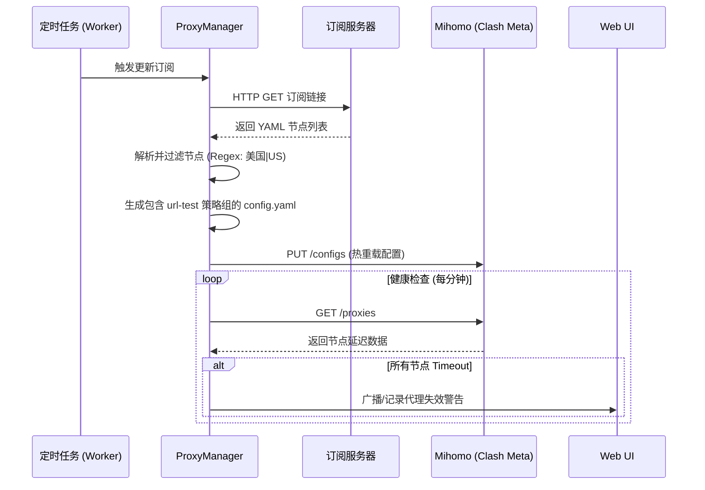
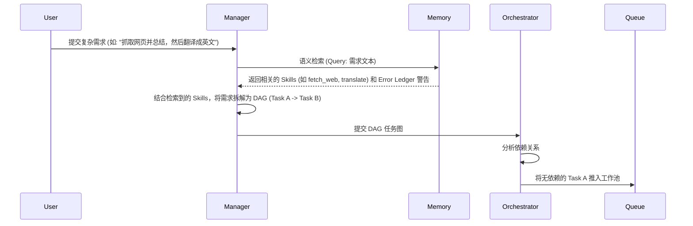
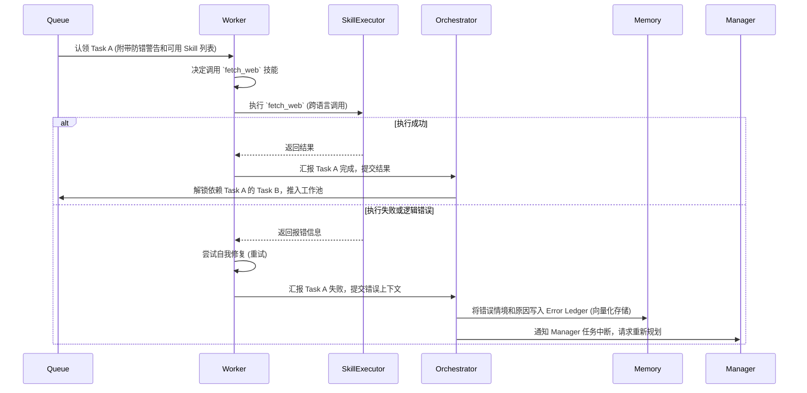

# Watery AI Agent - 架构设计文档 (Specs)

## 1. 功能需求 (Functional Requirements)

### 1.1 核心目标
构建一个高度自动化的个人 AI 代理系统，具备自我调度、自我纠错、自我生长的能力。系统采用“工作池”模式，支持图状依赖（DAG）任务拆解，并通过动态 API 路由选择最优模型。

### 1.2 关键特性 (Phase 2 & Beyond)
*   **工作池与编排 (Work Pool & Orchestrator)**：
    *   Manager Agent 负责意图理解、任务拆解（DAG），并将子任务推入队列。
    *   Worker Agents 异步并发认领并执行任务。
*   **按需检索的记忆网络 (RAG-based Memory)**：
    *   **技能库 (Skills)**、**错题集 (Error Ledger)**、**知识库 (Knowledge)** 必须以向量化或结构化的方式存储在数据库中。
    *   Manager Agent 在分配任务前，**仅通过语义检索 (Semantic Search)** 提取与当前任务高度相关的技能和防错提示，极大地降低 Token 消耗，避免上下文污染。
*   **多语言/跨平台技能执行 (Language-Agnostic Skills)**：
    *   技能不局限于 Python。系统支持执行 Shell 脚本、Node.js、Go 等任何可通过命令行或容器调用的可执行文件。
    *   每个技能拥有标准化的清单文件（Manifest，如 JSON/YAML），定义其输入参数、输出格式和执行引擎。

---

## 2. 技术栈 (Tech Stack)

*   **后端框架**: Python 3.11+, FastAPI (异步非阻塞)
*   **大模型接口**: 统一封装的 `AsyncOpenAI` 客户端 (支持 Volcengine, Gemini 等)
*   **关系型数据库**: SQLite (配合 SQLAlchemy/SQLModel) - 用于存储任务状态 (DAG)、技能元数据。
*   **向量数据库**: ChromaDB (轻量级，支持本地持久化) - 用于存储和检索 Skills 描述、Error Ledger 文本和知识库片段。
*   **网络代理 (Proxy Stack)**: Mihomo (Clash Meta) 容器化运行，专为 Gemini 等跨境 API 提供优选出的 Shadowsocks 2022 路由支持。
*   **任务队列**: `asyncio.Queue` (单机轻量级) 或 Redis (未来分布式扩展)。
*   **容器化**: Docker & Docker Compose。

---

## 3. 核心模块图 (Core Modules)

```mermaid
graph TD
    User[用户/前端/VSCode] -->|API Request| API[FastAPI 路由]
    API --> Manager[Manager Agent]
    
    subgraph Infrastructure [基础设施层]
        Clash[Mihomo/Clash Meta]
        API -->|Proxy Settings| Clash
        Clash -->|Routing| Gemini[Gemini API]
        API -->|Direct Connection| Volcengine[火山引擎 API]
    end
    
    subgraph Memory System [记忆与检索系统 (RAG)]
        VectorDB[(ChromaDB 向量库)]
        RelationalDB[(SQLite 关系库)]
        Retriever[Memory Retriever]
        Retriever -->|Semantic Search| VectorDB
        Retriever -->|Query Metadata| RelationalDB
    end
    
    Manager <-->|1. 检索相关技能与错题| Retriever
    Manager -->|2. 拆解任务 (DAG)| Orchestrator[Task Orchestrator]
    
    subgraph Work Pool [工作池]
        Queue[(Task Queue)]
        Orchestrator -->|3. 推送就绪任务| Queue
    end
    
    subgraph Execution Engine [执行引擎]
        Worker1[Worker Agent 1]
        Worker2[Worker Agent 2]
        Queue -->|4. 认领任务| Worker1
        Queue -->|4. 认领任务| Worker2
        
        SkillRunner[Skill Executor]
        Worker1 -->|调用| SkillRunner
        Worker2 -->|调用| SkillRunner
        
        SkillRunner -->|执行 .py| PythonEnv
        SkillRunner -->|执行 .sh| ShellEnv
        SkillRunner -->|执行 .js| NodeEnv
    end
    
    Worker1 -->|5. 返回结果/报错| Orchestrator
    Orchestrator -->|6. 更新错题集| Retriever
```

---

## 4. 数据库 Schema (Database Schema)

### 4.1 关系型数据库 (SQLite - SQLAlchemy)

*   **Task (任务表)**
    *   `id`: UUID (主键)
    *   `parent_id`: UUID (父任务ID，用于追踪归属)
    *   `description`: String (任务描述)
    *   `status`: Enum (PENDING, RUNNING, COMPLETED, FAILED)
    *   `dependencies`: JSON (依赖的任务 ID 列表)
    *   `result`: JSON (执行结果)
    *   `error_msg`: String (错误信息)

*   **SkillMetadata (技能元数据表)**
    *   `id`: String (技能唯一标识，如 `fetch_webpage`)
    *   `name`: String
    *   `language`: Enum (python, shell, nodejs, etc.)
    *   `entrypoint`: String (执行入口，如 `scripts/fetch.py`)
    *   `schema`: JSON (OpenAI Function Calling 格式的参数定义)

### 4.2 向量数据库 (ChromaDB Collections)

*   **Collection: `skills_vector`**
    *   `id`: 对应 `SkillMetadata.id`
    *   `document`: 技能的详细自然语言描述（用于语义匹配）
    *   `metadata`: `{"language": "python"}`
*   **Collection: `error_ledger_vector`**
    *   `id`: UUID
    *   `document`: 错误发生的上下文和具体表现
    *   `metadata`: `{"correction": "正确的做法说明", "related_skill": "skill_id"}`
*   **Collection: `knowledge_vector`**
    *   `id`: UUID
    *   `document`: 知识库文本块

---

## 5. 代理与网络子系统 (Proxy Subsystem)

### 5.1 架构设计
为了支持访问受限的 LLM API（如 Gemini, Claude），系统集成了一个独立的代理层。
*   **代理内核**: 使用 `metacubex/mihomo` (Clash Meta) 容器，以支持现代加密协议（如 `2022-blake3-aes-256-gcm`）。
*   **动态节点管理**: 
    *   `ProxyManager` (Python 服务) 定期拉取用户的订阅链接。
    *   解析 YAML 格式的节点列表，过滤出目标地区（如美国、日本）或特定名称的节点。
    *   利用 Mihomo 内置的 `url-test` 策略组，自动对过滤后的节点进行延迟测试，并始终将流量路由到延迟最低的可用节点。
*   **故障告警**: 
    *   通过 Mihomo 的 REST API (`http://clash:9090/proxies`) 监控 `url-test` 策略组的状态。
    *   如果所有节点均 `timeout`，则通过 `/api/v1/proxy/status` 接口向前端 Web UI 广播警告。

### 5.2 逻辑流 (Proxy Manager Flow)


---

## 6. 关键数据模型与接口 (Interfaces / Types)

```python
from pydantic import BaseModel, Field
from typing import List, Dict, Any, Optional
from enum import Enum

class TaskStatus(str, Enum):
    PENDING = "pending"
    RUNNING = "running"
    COMPLETED = "completed"
    FAILED = "failed"

class TaskNode(BaseModel):
    """DAG 中的任务节点"""
    id: str
    description: str
    dependencies: List[str] = Field(default_factory=list, description="必须先完成的任务 ID 列表")
    status: TaskStatus = TaskStatus.PENDING
    assigned_worker: Optional[str] = None
    result: Optional[Any] = None

class SkillManifest(BaseModel):
    """技能清单定义"""
    id: str
    name: str
    description: str
    language: str = Field(..., description="python, shell, nodejs 等")
    entrypoint: str = Field(..., description="相对路径或执行命令")
    parameters: Dict[str, Any] = Field(..., description="JSON Schema 格式的参数定义")

class MemoryQuery(BaseModel):
    """记忆检索请求"""
    task_description: str
    top_k_skills: int = 3
    top_k_errors: int = 2

class MemoryContext(BaseModel):
    """检索返回的上下文，注入给 Worker"""
    relevant_skills: List[SkillManifest]
    error_warnings: List[str]
```

---

## 6. 复杂业务逻辑流 (Logic Flow)

### 6.1 Manager Agent 任务拆解与分发流程



### 6.2 Worker Agent 执行与纠错流程


